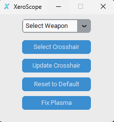

# XeroScope - Xero Crosshair Editor

## Introduction

XeroScope is a crosshair editor tool designed to modify and update crosshairs for weapons in Xero. This tool provides a user-friendly interface to select weapons and update their respective crosshairs.

## Features

- Select a weapon from a dropdown menu.
- Choose a custom crosshair image for the selected weapon.
- Update the crosshair for the selected weapon.
- Reset the crosshair to default settings.
- Fix Plasma: Copy a fixed crosshairs XML file to the Xero XML folder.

## Prerequisites

- Python 3.x
- tkinter library
- customtkinter library

## Installation

1. Clone or download the XeroScope repository.
3. Run the XeroScope.exe file to launch the XeroScope application.

## Usage

1. Launch the XeroScope application by running the main.py file.
2. Select a weapon from the dropdown menu.
3. Click the "Select Crosshair" button to choose a custom crosshair image for the selected weapon.
4. Click the "Update Crosshair" button to update the crosshair for the selected weapon.
5. To reset the crosshair to default settings, click the "Reset to Default" button.
6. To fix Plasma, click the "Fix Plasma" button.

## Configuration

XeroScope stores the Xero folder path in the config.ini file to locate the game files.

## License

This project is licensed under the MIT License.

## Acknowledgements

XeroScope was developed by [Jizen0x01], Tested by [-Karthus]

## Contributing

We welcome contributions from the community! If you'd like to contribute to XeroScope, whether it's by fixing a bug, adding a feature, or improving the documentation, we'd love to have your help.

Feel free to fork the repository, make your changes, and submit a pull request. We appreciate your contributions in making XeroScope better.

